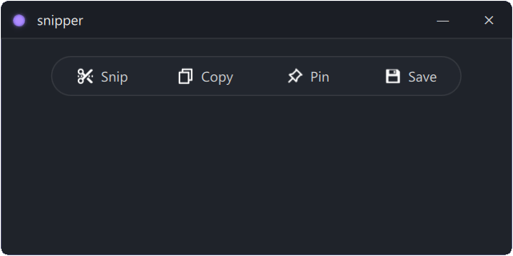

# ✂️ snipper
A minimalist, useful and performant screen capture utility made with C++ and Qt QML.

[View screenshots (no pun intended)](#-proof-of-concept)

## 🛠️ Installation
### Requirements
- C++20 compatible compiler
- CMake 3.16 or higher
- Qt 6

### Clone the repository
```bash
git clone https://github.com/anelkica/snipper.git
cd snipper
```
### Open in Qt Creator
Open the `snipper` folder in Qt Creator IDE to build and run the application.


## ✨ Features
- Region capture
  - Selection rectangle
  - *PLANNED*: Window capture
- Magnification
  - Scroll up/down while snipping
  - Save magnified snips

## 💫 Planned features..
- EasyOCR
- Color picking
- *UNCERTAIN*: GIF recording

## 🌄 Proof of concept 
<div align="center">
    
    <p>A small glimpse with regards to user interface</p>
</div>
<div align="center">
    
    <p>Region capture + magnification</p>
</div>