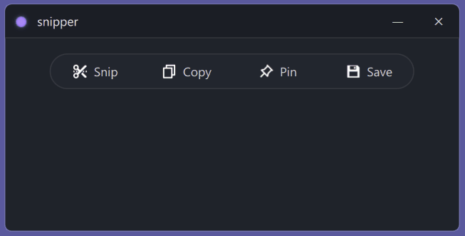

# ✂️ snipper
A minimalist, useful and performant screen capture utility made with C++ and Qt QML.

[View screenshots (no pun intended)](#-showcase)

## 🛠️ Installation
### Requirements
- C++23 compatible compiler
- CMake 3.16 or higher
- Qt 6

### Clone the repository
```bash
git clone https://github.com/anelkica/snipper.git
cd snipper
```
### Open in Qt Creator
Open the `snipper` folder in Qt Creator IDE to build and run the application.


## ✨ Features
- Region capture
  - Selection rectangle
  - *PLANNED*: Window capture
- Magnification
  - Scroll up/down while snipping
  - Save magnified snips
- Floating pins
  - Create floating stay-on-top snips
  - *SOON:* opacity
- Saving snips

## 💫 Planned features..
- EasyOCR
- Color picking
- *UNCERTAIN*: GIF recording

## 🎯 Todo
- [x] ~~Magnification~~
- [x] ~~Copy to clipboard~~
- [x] ~~Screenshot preview~~
- [x] ~~Picture-in-picture windows~~
- [x] ~~Save As functionality~~
- [ ] Settings for customizability
- [ ] Floating toolbar in snipping mode

## 🌄 Showcase
### snipper UI
<div align="center">
    
</div>
<div align="center">
    
</div>

### Snipping and magnification
<div align="center">
    
</div>

### Creating pinnable images
<div align="center">
    
    <p><i>right click to remove</i></p>
</div>
